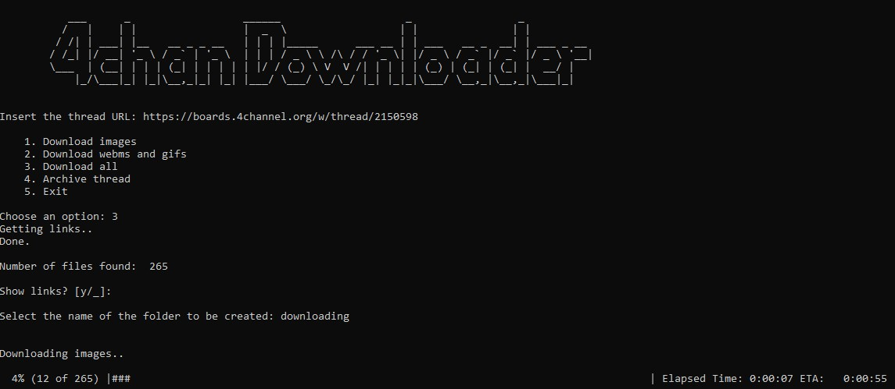

# 4chan-downloader



A simple tool to help saving 4chan stuff. It has 4 functions:

- Save all the images from the thread
- Save all the webms and gifs from the thread
- Save everything from the thread
- Take a full screenshot of a thread (Using chrome driver)

## Install Dependencies
```
pip install bs4
pip install requests
pip install selenium
pip install webdriver_manager
pip install progressbar2
```

## How to run
```
python main.py
```